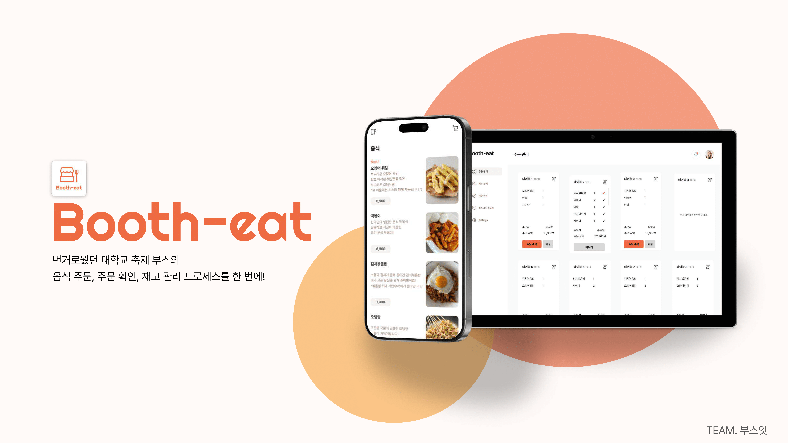

# BoothEat (부스잇)
### QR 코드 기반 축제 결제 서비스 (Backend 중심)


BoothEat은 대학 축제·동아리 행사에서 발생하는 **결제 대기 시간과 주문 오류**를 줄이기 위해  
테이블별 QR 코드(URL)로 주문을 받고, 매니저가 입금 내역을 확인해 **승인/거절**하는 모바일 키오스크형 결제 서비스입니다.

프로토타입 개발 이후 배포를 완료했고, **실제 행사에서 운영했으며 기능을 추가 개발**하고 있습니다.

---

## Summary
- 역할: **백엔드 개발 (설계 · 구현 · 배포 · 운영)**
- 팀 구성: **기획자 2 / 백엔드 1 / 프론트엔드 1**
- Tech
  - Backend: **Spring Boot, Spring Data JPA**
  - DB: **H2(초기) → MySQL 전환 고려**
  - Frontend: React
  - Infra/Deploy: **AWS Lightsail**, MobaXterm(SSH), FileZilla(SFTP)
  - Domain: **Gabia** 구매 및 연결 (modney.shop)
- 핵심 기능
  - 주문 상태 관리 **PENDING / APPROVED / REJECTED / FINISHED**
  - 메뉴 품절 토글 (`available`)
  - 매출/랭킹 집계 (GROUP BY)
  - **할인코드 적용 로직** (운영 중 추가 개발)

---

## 🚀 Live Demo (배포)
- **Manager**
  - https://modney.shop/manager/booths/1/menus
- **Customer (Mobile Web)**
  - https://modney.shop/booths/1/tables/1/menu

> ⚠️ 고객 화면은 모바일 UX 기반으로 **모바일 접속을 권장**합니다.

---

## 📄 Documentation
- [Bootheat 프로젝트 안내서 (PDF)](./docs/bootheat-guide.pdf)
  > 창업 해커톤 발표를 위해 **기획자가 작성한 서비스 가이드 문서**입니다. (컨셉/기능/화면 흐름 참고)

---

## Project Timeline & Status
- **2025.07**: 프로토타입 개발
- **2025.08**: 기능 완성 및 배포 (AWS Lightsail)
- **2025.09 (운영)**: 실 서비스 운영 + 추가 개발(할인코드, UI 수정)
- **2025.12~ (예정)**: Docker, Redis 등 고도화

---

## Real-world Usage (실제 운영)
- 운영 기간: **2025년 9월, 숭실대 대동제**
- 서비스 대상: **SSCC, 로타렉트**
- 운영 방식: 테이블 QR 기반 주문 + 매니저 승인(입금 수동 대조)

---

## Core Logic
- 주문 상태(State) 기반 처리
  - `PENDING → APPROVED → FINISHED`
  - `PENDING → REJECTED`
- 할인코드 로직(추가 개발)
  - 코드 유효성 검증 → 할인 적용 → 최종 결제 금액 계산
- 품절 토글
  - `menu_item.available` 기반 주문 차단
- 통계/랭킹
  - `APPROVED` + 날짜 조건으로 `GROUP BY` 집계

---
## 🧩 React 연동 및 배포 방식

프론트엔드(React)는 별도 서버를 두지 않고,  
**빌드 산출물을 Spring Boot 프로젝트에 정적 리소스로 포함**하여  
하나의 애플리케이션으로 배포하는 방식을 사용했습니다.

### 구조
- Frontend: React
- Backend: Spring Boot
- 배포 방식: **React build → Spring `static/` 폴더 포함 → 단일 서버 배포**

---

### Build & Integrate

1) React 프로젝트 빌드
```bash
cd frontend
npm install
npm run build
``` 
2) 빌드 결과물을 Spring 정적 리소스 경로로 복사
- React build 결과물: frontend/build/
- Spring 정적 리소스 경로: backend/src/main/resources/static/

---

# 🧑‍💻 Dev Log (개발자용)
아래는 프로젝트를 **로컬/서버에서 실행**하기 위한 최소 절차입니다.

## 1) Local Run (로컬 실행)
> 초기 개발 환경은 `application.properties` + H2 기준입니다.

### Prerequisite
- JDK 17+ (또는 프로젝트에 맞는 버전)
- Gradle Wrapper 사용

### Run
```bash
./gradlew bootRun
http://localhost:8080/manager/booths/1/orders
http://localhost:8080/booths/1/tables/1/menu